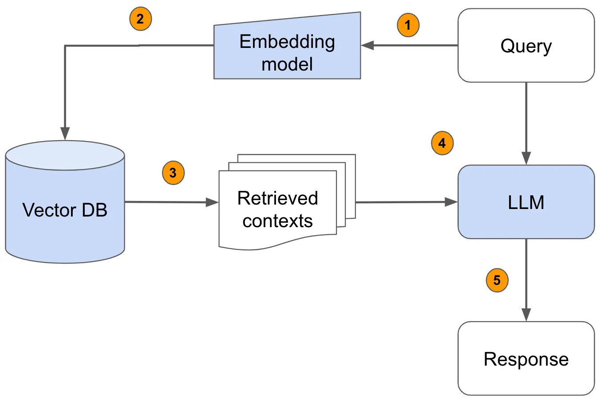

In this project I'm trying to make good AI code generator (analogue of [github copilot](https://github.com/features/copilot)) with RAG (Retrieval Augmented Generation), using [llamaindex](https://www.llamaindex.ai).

# What is RAG?


Image source: [anyscale](https://www.anyscale.com/blog/a-comprehensive-guide-for-building-rag-based-llm-applications-part-1)

If we have some specific data, it would be too expensive and long to retrain LLM, using this information. RAG can really help in these situations. Before passing the prompt to the LLM, we are trying to find the similar context from the additional files. 

1. Embedding represents text as complex mathematical vector
2. The embedding result passes into vector data base
3. According to the distance, we retrieve the top-k relevant contexts
4. Pass the context and prompt to LLM
5. LLM generates answer

# Improvements

## Embeddings

Embedding models take text as input, and return a long list of numbers used to capture the semantics of the text. So it can be important what embedding are we using. The order of words is not really important in text, but in code it could break everything. We can choose one of this embeddings:

1. [BAAI/bge-base-en-v1.5](https://huggingface.co/Salesforce/codet5p-110m-embedding)
2. [codesage/codesage-small](codesage/codesage-small)

(I'm testing only free versions, so I skipped the [ada-002](https://platform.openai.com/docs/guides/embeddings))

Additional information for RAG contains my [project](https://github.com/worthlane/quadratic_equation) from github, which solves quadratic equation. I'll try to describe some function by words and compare what context relates to this prompt with different embeddings. We can see the context by function from the```Response``` class. I've found it in ```llamaindex``` source code:

```python
class Response:
    """Response object.

    Returned if streaming=False.

    Attributes:
        response: The response text.

    """

    ...

    def get_formatted_sources(self, length: int = 100) -> str:
        """Get formatted sources text."""
        ...
```

### Tests

#### BAAI/bge-base-en-v1.5

After some tests I've noticed, that the context that program is finding, in the most cases is located in header files. I think that's because ```bge-base``` was made for text embedding, and it's hard for him to recognize code. My project has a lot of documentation, so, retriever gets information from header file, where documentation is located.

#### codesage/codesage-small

This embedding is not as popular as ```bge```, but it is specialized for finding code by text description. I've asked this function to do it's own quadratic equation solving implementation, but context it've found looks like:
```
</tr>
        <tr>
          <td></td>
          <td>)</td>
          <td></td><td></td>
        </tr>
      </table>
</div><div class="memdoc">

<p>Solves linear equatiion (bx + c = 0) </p>
<dl class="params"><dt>Parameters</dt><dd>
  <table class="params">
    <tr><td class="paramdir">[in]</td><td class="paramname">b</td><td>coefficient </td></tr>
    <tr><td class="paramdir">[in]</td><td class="paramname">c</td><td>coefficient </td></tr>
    <tr><td class="paramdir">[out]</td><td class="...
```

This embedding is confused by html documentation code. So, what embedding you should use depends on documentation availability.

If you have documentation, it will be better to use ``` BAAI/bge-base-en-v1.5```, because it is easy for this embedding to find text description in project. If there is no documentation, it will be better to use ```codesage/codesage-small```, because it is created for finding code by natural language.


## LLM

I've found three interesting LLM's to test. As RAG I would use my project that solves quadratic equation. The prompt will ask an implementation of function, that solves quadratic equations, using equation coefficients.

LLMs:
1. Llama 3.1 (8B)
2. Moondream 2 (1.4B)
3. deepseek-coder-v2 (16B)
3. Code Llama (7B)

(I've tested every model on MacBook Pro with 8gb of RAM)

### Llama 3.1
Works pretty well. In six out of ten launches it returned well working code for my project. One time code worked almost correct (4/5 tests passed), two times partially correct (3/5) and in other cases code did not compile.

The shortest query time was 28.99s. The longest time was 56.6s. In average it needed about 40s for query. Pretty good result.

### Moondream 2
This model is not as heavy as ```llama3```, so we can notice that in the query time. This model works much faster, but it has no benefit. Usually it gives answers like ```000``` or ```________```, not even at least a code. So this is very bad model for code generation.

### deepseek-coder-v2
Deepseek is the heaviest model I've tested here. It was actually created for code generation. But on the first launch it became very clear, that for my configuration this model works too slow (It generated one answer for 20 minutes). It can generate correct code, but it is too slow, not even comparable with ```llama3```.

### Code Llama
The same situation as with ```deepseek```. It gives answers, that are not better or worse than ```llama3```, but execution time increased.

After all these tests I've decided, that ```llama3``` is the best model for my configuration.

## Prompt

It's interesting to check, what prompt should we write to get the most efficient answers. Let's delete some function from our project and ask our program to recreate it. We have three variants:

1. RAG-, prompt+ (We can add some context in prompt, like code from file where we had this function, and remove this file from documents).
2. RAG+, prompt+ (We can add the context in prompt, but we wont delete file from documents).
3. RAG+, prompt- (We can leave prompt without any context).

Let's check which strategy generates code better.

### Measurements

#### RAG-, PROMPT+

| Attempt | Query time, sec | Accuracy | 
|:--:|:--:|:--:|
| 1 | 76.90 | Not compiling |
| 2 | 54.45 | 5/5 tests passed |
| 3 | 45.45 | Not compiling |
| 4 | 48.68 | Not compiling |
| 5 | 62.72 | Not compiling |
| 6 | 129.80 | 0/5 tests passed |
| 7 | 86.11 | Not compiling |
| 8 | 51.70 | Not compiling |
| 9 | 67.50 | Not compiling |
| 10 | 55.00 | 0/5 tests passed |

#### RAG+, PROMPT+

| Attempt | Query time, sec | Accuracy | 
|:--:|:--:|:--:|
| 1 | 71.04 | 0/5 tests passed |
| 2 | 91.89 | 0/5 tests passed |
| 3 | 61.85 | 3/5 tests passed |
| 4 | 79.61 | Not compiling |
| 5 | 51.07 | Not compiling |

#### RAG+, PROMPT-

| Attempt | Query time, sec | Accuracy | 
|:--:|:--:|:--:|
| 1 | 56.60 | 5/5 tests passed |
| 2 | 37.20 | 5/5 tests passed |
| 3 | 68.50 | 3/5 tests passed |
| 4 | 42.80 | 4/5 tests passed |
| 5 | 42.17 | 5/5 tests passed |
| 6 | 46.87 | 5/5 tests passed |
| 7 | 49.88 | 0/5 tests passed |
| 8 | 39.72 | 5/5 tests passed |
| 9 | 39.26 | 5/5 tests passed |
| 10 | 28.99 | 1/5 tests passed |

## Execution time

```py
response = query_engine.query("Give me a program, that will do XOR operation with 3 integers and return the binary result of operations"
                               "Think step by step, this is very important for my career. Respond to me only with code.")
```

That's the place where program starts working too slow.

```query_engine``` is from ```BaseQueryEngine``` class. So, ```query``` function's code is
```py
def query(self, str_or_query_bundle: QueryType) -> RESPONSE_TYPE:
        dispatcher.event(QueryStartEvent(query=str_or_query_bundle))
        with self.callback_manager.as_trace("query"):
            if isinstance(str_or_query_bundle, str):
                str_or_query_bundle = QueryBundle(str_or_query_bundle)
            query_result = self._query(str_or_query_bundle)
        dispatcher.event(
            QueryEndEvent(query=str_or_query_bundle, response=query_result)
        )
        return query_result
```


